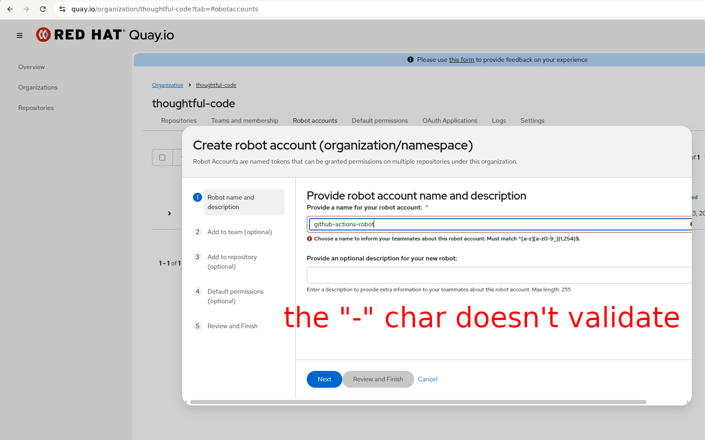
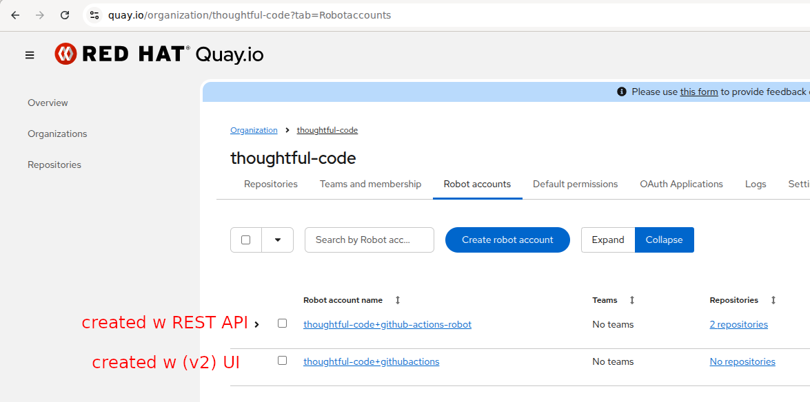

# Bug: New UI rejects valid robot account names containing dashes

## Summary

The new React UI for creating robot accounts rejects names with dashes (e.g. `github-actions-robot`), but the REST API accepts them. The UI's frontend validation regex is stricter than the backend's.

## Current behavior

The "Create robot account" dialog in the new UI validates robot names against:

```
^[a-z][a-z0-9_]{1,254}$
```

This allows lowercase letters, digits, and underscores, but **not dashes or dots**. Entering `github-actions-robot` shows the error: *"Must match ^[a-z][a-z0-9_]{1,254}$."*



The validation is hardcoded in two places:
- `web/src/components/modals/CreateRobotAccountModal.tsx:117`
- `web/src/components/modals/robotAccountWizard/NameAndDescription.tsx:29`

The legacy Angular UI uses the same pattern from `static/js/constants/name-patterns.constant.ts:6`.

## Expected behavior

The REST API validates robot names through `data/model/user.py:343`, which calls `validate_username()` in `util/validation.py:37`:

```
^([a-z0-9]+(?:[._-][a-z0-9]+)*)$
```

This allows dashes, dots, and underscores as separators between alphanumeric segments. Creating `github-actions-robot` via the API works fine:

```bash
curl -s -X PUT \
  -H "Authorization: Bearer $QUAY_API_TOKEN" \
  -H "Content-Type: application/json" \
  -d '{"description": "GitHub Actions OIDC robot"}' \
  "https://quay.io/api/v1/organization/thoughtful-code/robots/github-actions-robot"
```

The robot appears in the UI and functions normally:



## Inconsistency with other entity types

In the same constants file, team and user patterns allow dashes:

| Entity | Pattern | Dashes |
| :---- | :---- | :---- |
| Robot | `^[a-z][a-z0-9_]{1,254}$` | No |
| Team | `^([a-z0-9]+(?:[._-][a-z0-9]+)*)$` | Yes |
| Username | `^(?=.{2,255}$)([a-z0-9]+(?:[._-][a-z0-9]+)*)$` | Yes |

## Fix

The frontend robot name regex should match the backend's `validate_username()` pattern so users can create robot names with dashes through the UI.

## Tested on

quay.io (SaaS), May 2026. Source code inspected at quay/quay commit `a56c75df4`.
