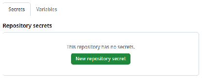

**Push images to Quay without a password**

"This repository has no secrets". Who doesn't want this screenshot to provide to a security auditor, right?



Red Hat Quay supports *keyless* (ephemeral) robot-account authentication via OIDC. This means that you can authenticate GitHub Actions jobs to [quay.io](https://quay.io) to pull or push images without storing a long-lived token in a GitHub Action secret.

Instead of burying a static token in your GitHub settings that lives forever until it's accidentally exposed, you let GitHub and Quay negotiate a one-time credential on every CI run.

**In short:**

1. **Create a robot account** in Quay.
2. **Configure robot federation** pointing to GitHub's OIDC issuer and set the subject to match your repository (e.g. `repo:ktdreyer/quay-oidc-demo:ref:refs/heads/main`).
3. In GitHub Action workflow, **request an OIDC token** from Github, **exchange it** for a short-lived Quay robot token, and **use that token** to log in to Quay and push/pull images.

I've based this guide on [Quay's product docs: Keyless authentication with robot accounts](https://docs.redhat.com/en/documentation/red_hat_quay/3.16/html/manage_red_hat_quay/keyless-authentication-robot-accounts).

---

## Part 1: Create a repository and robot account in Quay

First we need somewhere for your container images to land. This takes about 30 seconds.

To create a new repository, in the [Quay UI](https://quay.io/): **Organizations > \<your-quay-org\> > Create New Repository**. In my example, my quay org is `thoughtful-code`, so I created `thoughtful-code/quay-oidc-demo`.

Next, create a **Robot Account** that can push images to this repository:
1. In the Quay UI go to **Organizations > \<your-quay-org\> > Robot Accounts**.
2. Click **Create Robot Account** and give it a name. I called mine `githubactions`.
3. Remember this bot's full Quay **username** (`<org>+<robot-name>`). You'll need it later in your GitHub Action YAML. In my example, my quay org is `thoughtful-code`, so I have `thoughtful-code+githubactions`. (As of Quay 3.16, robot federation only works for robot accounts in Quay *orgs*, not robot accounts for individual Quay users.)

Now we must grant the robot write permission on the target repository:
1. Go to the repository in Quay (e.g. `your-quay-org/quay-oidc-demo`).
2. Click **Settings > User and Robot Permissions**.
3. Add the robot account and set its role to **Write**.

---

## Part 2: Set up robot-account federation (linking Quay to GitHub's OIDC provider)

We're going to configure Quay.io to trust the OIDC tokens that your GitHub Action will mint.

   - In Quay, go to **Organizations > \<your-org\> > Robot Accounts**
   - Click the kebab menu icon [⋮] and choose **Set robot federation**.
   - Click **+** and fill in:

| Field | Value |
| :---- | :---- |
| **Issuer URL** | `https://token.actions.githubusercontent.com` |
| **Subject** | `repo:ktdreyer/quay-oidc-demo:ref:refs/heads/main` (adjust to match your GitHub repository and ref) |

   - Click **Save**.

The `Subject` is important for security. It limits "who" and "what" can authenticate to Quay. In this example, I only allow actions in my `ktdreyer/quay-oidc-demo` Git repository, and only Actions that run directly on the `main` branch. Quay will reject tokens from actions on "work-in-progress" branches or forks.

Note that the GitHub owner (`ktdreyer`) or org does not need to match the Quay org (`thoughtful-code`). The `subject` controls *who can mint the token*; the Quay org controls *where the image lands*.

---

## Part 3: Use the OIDC token in a GitHub Actions workflow

Here's the fun part. Do not even *think* about adding a static Quay token as a GitHub Actions secret! That's so 2025!

```yaml
# .github/workflows/build-push.yml
name: Build & push to Quay

on:
  push:
    branches: [ main ]

permissions:
  # Required for OIDC token exchange
  id-token: write
  contents: read

jobs:
  build:
    runs-on: ubuntu-latest
    env:
      QUAY_ROBOT_USER: thoughtful-code+githubactions   # <org>+<robot-name>
    steps:
      - name: Checkout code
        uses: actions/checkout@v6

      - name: Build image
        run: |
          podman build -t quay.io/thoughtful-code/quay-oidc-demo:latest .

      - name: Obtain OIDC token for Quay
        run: |
          set -o pipefail

          # Ask GitHub to prove who we are (signed OIDC token)
          OIDC_TOKEN=$(curl -sSf -H "Authorization: bearer $ACTIONS_ID_TOKEN_REQUEST_TOKEN" \
            "$ACTIONS_ID_TOKEN_REQUEST_URL" | jq -r .value)

          # Trade that proof (OIDC_TOKEN) for short-lived Quay robot token
          QUAY_TOKEN=$(curl -sSf \
            "https://quay.io/oauth2/federation/robot/token" \
            -u "$QUAY_ROBOT_USER:$OIDC_TOKEN" | jq -r .token)

          # Export the token for later steps
          echo "QUAY_TOKEN=$QUAY_TOKEN" >> $GITHUB_ENV

      - name: Log in to Quay
        uses: redhat-actions/podman-login@v1
        with:
          registry: quay.io
          username: ${{ env.QUAY_ROBOT_USER }}
          password: ${{ env.QUAY_TOKEN }}

      - name: Push image
        run: |
          podman push quay.io/thoughtful-code/quay-oidc-demo:latest
```

The `podman-login` step uses the temporary `QUAY_TOKEN` as the password. This token expires after one hour. I recommend running `login` *after* you've done your build. The build step doesn't *need* the token, and with this pattern you can limit the short-lived `QUAY_TOKEN` to the exact steps that need it.

Push a commit to `main` and watch the action run! If you've set everything correctly, a fresh image will land in your Quay.io repo, no long-lived API keys in sight.

---

## Where to go from here

 * **Lock down who can push:** You could scope the `subject` to a GitHub Actions [environment](https://docs.github.com/en/actions/managing-workflow-runs-and-deployments/managing-deployments/managing-environments-for-deployment) with `repo:ktdreyer/quay-oidc-demo:environment:production`. This further limits which CI jobs can push images.

 * **Scaling to many GitHub repos:** As a more advanced configuration, you can [customize GitHub's subject claim template](https://docs.github.com/en/actions/security-for-github-actions/security-hardening-your-deployments/about-security-hardening-with-openid-connect#customizing-the-subject-claims-for-an-organization-or-repository) at the GitHub org level to include fields like `repository_owner` or `repository_visibility` to permit access to certain *categories* of GitHub repos. See [GitHub's OIDC reference](https://docs.github.com/en/actions/reference/openid-connect-reference) for the full list of subject claims.

 * **Beyond GitHub:** OIDC will also work with Git forges like [GitLab](https://docs.gitlab.com/ci/secrets/id_token_authentication/) or [Forgejo](https://forgejo.org/docs/next/user/actions/security-openid-connect/).

 * **Pulling a private base image:** In our example, we built an image from a public base and pushed it at the end. If you wanted to pull a *private base image* in your build process, you would simply authenticate to Quay with OIDC first *before* building. If your build process takes longer than an hour, you'd authenticate to Quay a second time in the job for the push operation.

**Links**

Learn more about OIDC with Quay and GitHub:

- [Keyless authentication with robot accounts](https://docs.redhat.com/en/documentation/red_hat_quay/3.16/html/manage_red_hat_quay/keyless-authentication-robot-accounts) - Red Hat Quay 3.16 documentation.
- [Access Quay on OpenShift with short-lived credentials](https://developers.redhat.com/articles/2025/04/22/access-quay-openshift-short-lived-credentials) - Red Hat Developer article on OpenShift integration.
